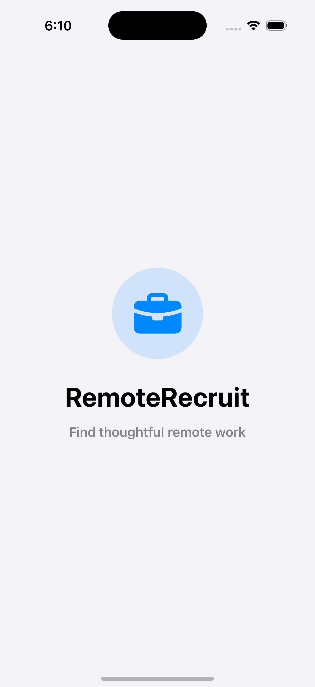
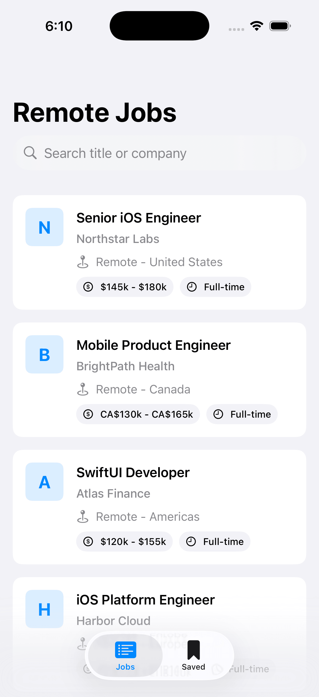
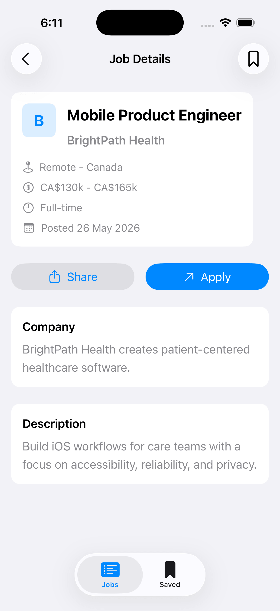
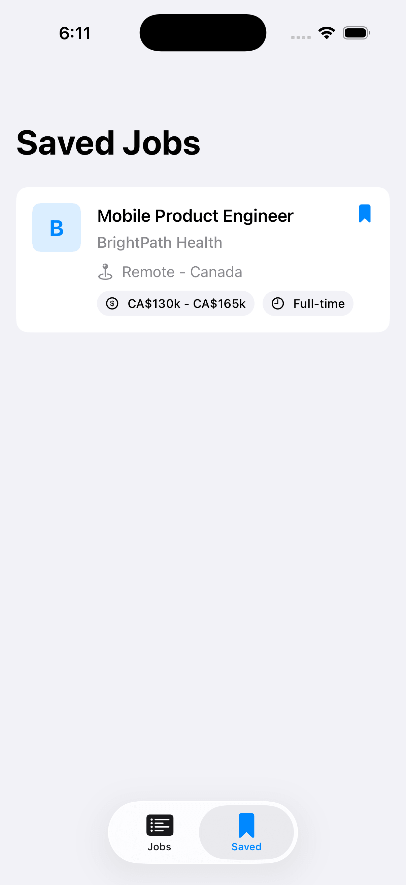

# RemoteRecruit

RemoteRecruit is a SwiftUI iOS job browser built for a technical interview take-home. It demonstrates a maintainable MVVM structure, repository-driven data access, dependency injection, persistence, and a polished native user experience.

## Features

- Splash screen with app branding
- Remote job list backed by the Remotive API
- Bundled `jobs.json` fallback with 50 sample jobs
- Pull to refresh
- Real-time debounced search by job title or company
- Recent search history with local persistence
- Job details with company information, description, salary, location, job type, posted date, sharing, save, and apply actions
- Saved jobs tab with local persistence
- Loading, empty, and error states
- Dynamic Type friendly SwiftUI layouts
- VoiceOver labels and accessibility identifiers on key controls
- Displaying all required data points: Title, Company, Location, and Salary Range (with formatting logic for different currencies).

## Architecture

The project is organized around MVVM and a layered structure:

- `App`: app entry point, root flow, and tab setup
- `Core`: networking, dependency injection, extensions, and design constants
- `Domain`: app models, repository protocols, and use cases
- `Data`: API services, DTOs, mapping, repositories, and local stores
- `Features`: feature-specific views and view models
- `Resources`: bundled fallback data
- `RemoteRecruitTests`: unit tests for view models, use cases, and repository behavior
The UI depends on view models, view models depend on use case protocols, use cases depend on repository protocols, and the repository coordinates remote/local services plus persistence. This keeps the app easy to test and easy to extend.

Leverages Swift 5.10 with async/await for all asynchronous networking and persistence tasks.

## Setup

1. Open `RemoteRecruit.xcodeproj` in Xcode.
2. Select an iOS simulator.
3. Build and run the `RemoteRecruit` scheme.

The app uses the Remotive public API when available. If the network request fails, it falls back to the bundled sample data automatically.

## Testing

Run tests from Xcode with `Command-U`, or use:

```sh
xcodebuild test -project RemoteRecruit.xcodeproj -scheme RemoteRecruit -destination 'platform=iOS Simulator,name=iPhone 16'
```

## Assumptions and Trade-offs

- UserDefaults is used for saved jobs and recent searches to keep the project lightweight and reviewable.
- The bundled JSON file serves as both a development fallback and an offline-friendly safety net.
- Infinite scrolling is represented by a repository structure that can support paging later; Remotive's simple endpoint does not require it for this implementation.
- Company logos use an accessible native placeholder to avoid introducing image-caching complexity for an API that does not provide stable logo URLs.

## Screenshots

| Splash Screen | Job List | Job Details | Saved Jobs |
|--------------|----------|-------------|------------|
|  |  |  |  |

## Future Improvements

- Add SwiftData-backed offline caching for the full job catalog.
- Add API pagination if the selected backend supports it.
- Add a dedicated image cache when using a provider with company logos.
- Add deep links to open job details directly.
- Add lightweight analytics events around search, save, share, and apply.
- Add feature flags for API provider selection.

